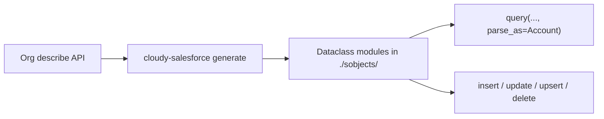

# cloudy-salesforce

Typed Salesforce from your org's metadata — not another dynamic dict client.

[](https://github.com/fishygeek91/cloudy-salesforce/actions/workflows/ci.yml)
[](https://pypi.org/project/cloudy-salesforce/)
[](https://www.python.org/downloads/)
[](https://github.com/fishygeek91/cloudy-salesforce/blob/main/LICENSE)

Generate dataclasses from your org's live describe metadata — picklist `Literal` unions, child relationships as nested lists — then query with `parse_as` and get real attributes instead of dict keys.

```python
from cloudy_salesforce import SalesforceClient, UsernamePasswordAuthentication, query
from sobjects import Account  # generated from your org

client = SalesforceClient(UsernamePasswordAuthentication(
    username="you@example.com", password="...", security_token="...",
))
accounts = query(
    "SELECT Id, Name, Industry, (SELECT Id, Name FROM Opportunities) FROM Account LIMIT 1",
    client=client,
    parse_as=Account,
)
account = accounts[0]
account.Industry          # Literal["Technology", "Finance", ...] | str
account.Opportunities     # list[Opportunity] | None
```

Full generated output: [`examples/generated/Account.py`](examples/generated/Account.py).

| Before (dict client) | After (cloudy-salesforce) |
|---|---|
| `result["records"][0]["Industry"]` | `account.Industry` |
| untyped string keys | IDE autocomplete on your org's fields |
| nested subqueries as nested dicts | `account.Opportunities[0].Name` |

## Install

```bash
pip install -e ".[dev]"   # local development
pip install cloudy-salesforce
```

Requires Python 3.10+.

## Generate dataclasses

```bash
cloudy-salesforce init
```

Copy `.env.example` to `.env` and fill in `SF_USERNAME`, `SF_PASSWORD`, and `SF_SECURITY_TOKEN`, then run codegen against your org:

```bash
cloudy-salesforce generate --alias prod
```

Limit to specific sObjects:

```bash
cloudy-salesforce generate --alias prod --sobjects Account
```

Codegen writes dataclass modules to `./sobjects/` by default.

## Query

Typed builder on generated dataclasses. `execute()` paginates automatically and returns `list[Account]`:

```python
from sobjects import Account

accounts = (
    Account.select("Id", "Name", "Industry")
    .where(Industry="Technology")
    .order_by("Name")
    .limit(10)
    .execute(client=client)
)
account = accounts[0]
account.Industry
```

Operators use a suffix: `Name__like="Acme%"`, `Industry__in=["Technology", "Finance"]`, `CreatedDate__gte=...`, `Id__null=False`. `select()` with no fields picks every scalar field (not child relationships). `to_soql()` renders the string without calling the API.

Raw SOQL still works — use it for subqueries the builder does not cover yet:

```python
from cloudy_salesforce import query
from sobjects import Account

accounts = query(
    "SELECT Id, Name, Industry, (SELECT Id, Name FROM Opportunities) FROM Account",
    client=client,
    parse_as=Account,
)
accounts[0].Opportunities[0].Name
```

Dict response (same shape as the REST API):

```python
result = query("SELECT Id, Name, Industry FROM Account LIMIT 5", client=client)
industry = result["records"][0]["Industry"]
```

Set a default client once from an auth strategy and omit `client=` on later calls:

```python
SalesforceClient.set_default_instance(auth)
accounts = Account.select("Id").execute()
```

## Insert, update, upsert, delete

Pass a generated dataclass (or a list of them). The sObject API name is taken from `__sf_meta__`; `None` fields and nested relationship objects are omitted.

```python
from cloudy_salesforce import insert, update, upsert, delete
from sobjects import Account

results = insert(Account(Name="Acme", Industry="Technology"), client=client)
results[0].id
results[0].success

insert([Account(Name="Acme"), Account(Name="Globex")], client=client)
update(Account(Id="001...", Name="Acme Corp"), client=client)
upsert(Account(Name="Acme", External_Id__c="x1"), external_id_field="External_Id__c", client=client)
delete(Account(Id="001..."), client=client)
```

Dict form still works:

```python
insert("Account", [{"Name": "Acme"}], client=client)
```

Operations use the Salesforce composite collection API and batch records automatically (default batch size 200). REST failures raise `SalesforceError` with `error_code` and `status_code`.

## How codegen works



| Metadata | Generated type |
|---|---|
| Picklist / multipicklist field | `Literal["Value1", "Value2", ...] \| str` |
| Child relationship (e.g. Opportunities on Account) | `list[Opportunity] \| None` |
| Lookup / reference field | `str \| None` (Id); relationship object only if that sObject is also generated |
| Standard scalar fields | `str`, `int`, `float`, `bool`, `datetime.date`, or `datetime.datetime` |

Picklist literals reflect active values at generation time. The `| str` fallback covers values added to the org later.

## Authentication

```python
from cloudy_salesforce import SalesforceClient, UsernamePasswordAuthentication

auth = UsernamePasswordAuthentication(
    username="you@example.com",
    password="your-password",
    security_token="your-token",
)
client = SalesforceClient(auth)
```

JWT bearer flow (Connected App with certificate):

```python
from cloudy_salesforce import JwtBearerAuthentication, SalesforceClient

auth = JwtBearerAuthentication(
    client_id="your-connected-app-consumer-key",
    username="you@example.com",
    private_key_path="/path/to/private.pem",
)
client = SalesforceClient(auth)
```

Existing access token (no login call):

```python
from cloudy_salesforce import SalesforceClient, SessionAuthentication

auth = SessionAuthentication(
    access_token="00D...",
    instance_url="https://your-instance.my.salesforce.com",
)
client = SalesforceClient(auth)
```

Or load credentials from `.cloudy_config` and environment variables:

```python
client = SalesforceClient.from_config(alias="prod")
client = SalesforceClient.from_config(alias="jwt")
client = SalesforceClient.from_config(alias="session")
```

Sandbox:

```python
auth = UsernamePasswordAuthentication(
    username="you@example.com",
    password="your-password",
    security_token="your-token",
    login_url="https://test.salesforce.com",
)
client = SalesforceClient(auth)
```

## Comparison

| | cloudy-salesforce | [simple-salesforce](https://github.com/simple-salesforce/simple-salesforce) | [aiosalesforce](https://github.com/georgebv/aiosalesforce) |
|---|---|---|---|
| Org-generated types | Yes — dataclasses from describe | No — dict responses | No — dict responses |
| Typed SOQL builder | Yes — `Account.select().where()` | No | No |
| Picklist `Literal` unions | Yes | No | No |
| Nested subquery pagination | Automatic | Manual | Manual |
| Composite CRUD (batch DML) | Yes | Partial | Partial |

## Status

v0.3.0 · Python 3.10+ · [MIT License](LICENSE) · Not affiliated with Salesforce, Inc.
